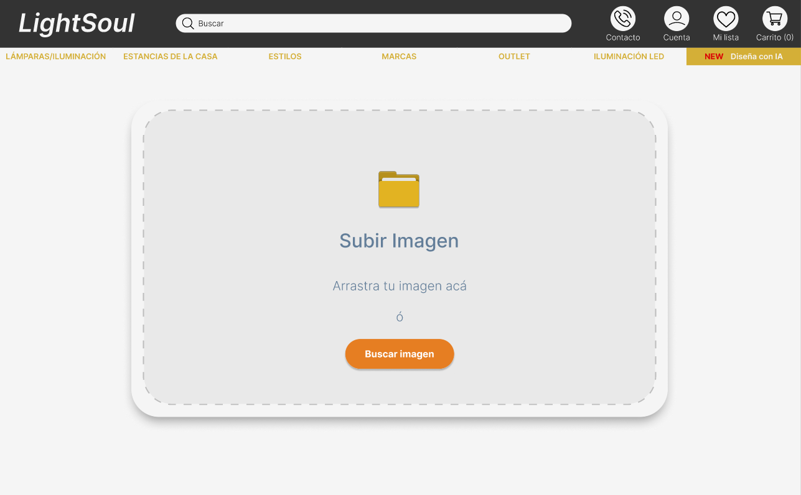
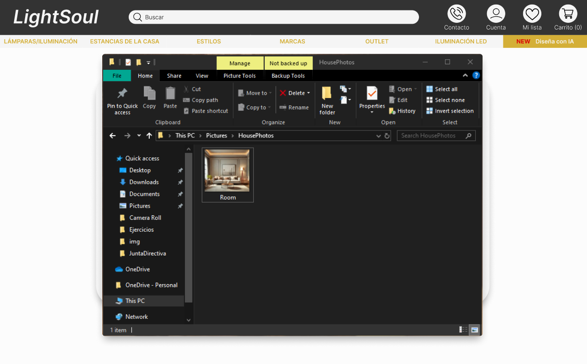
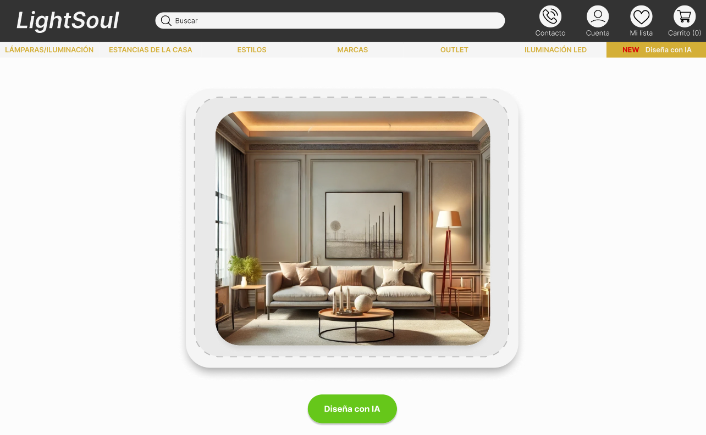
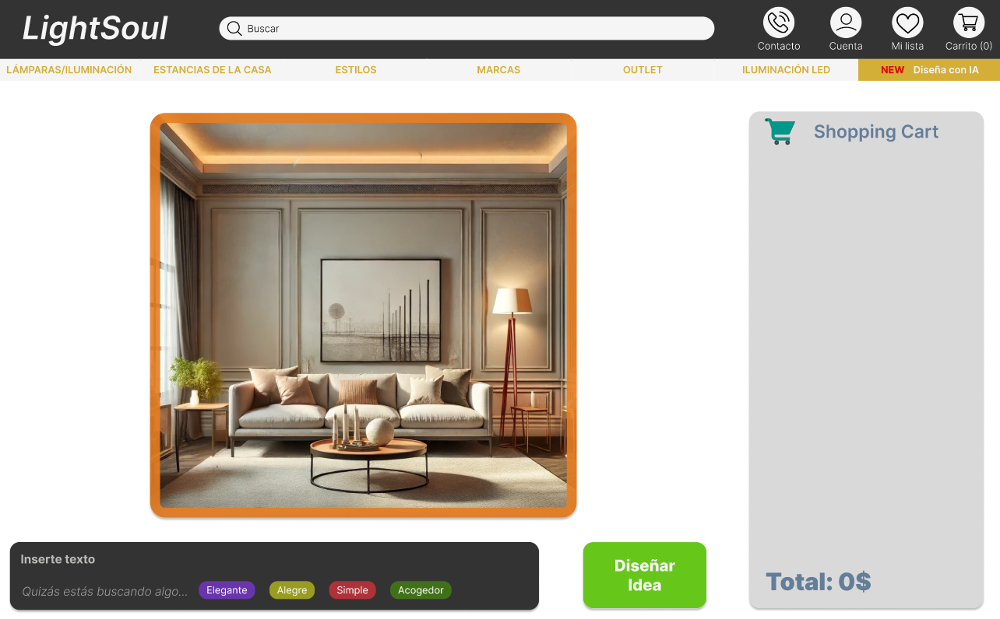
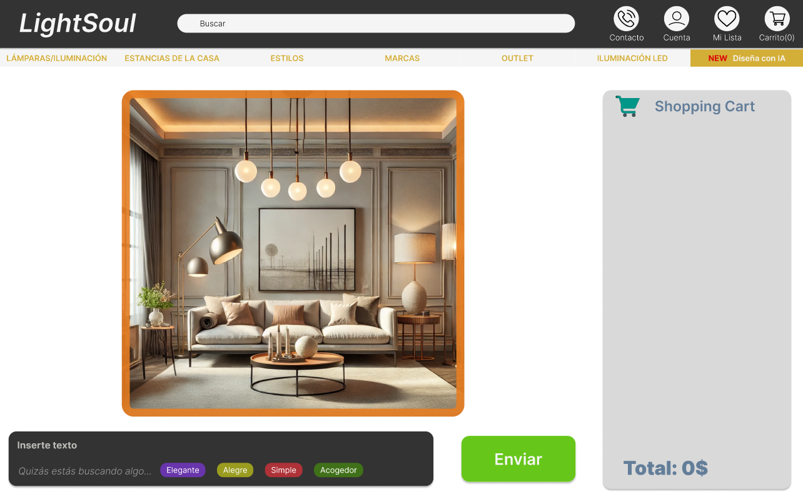
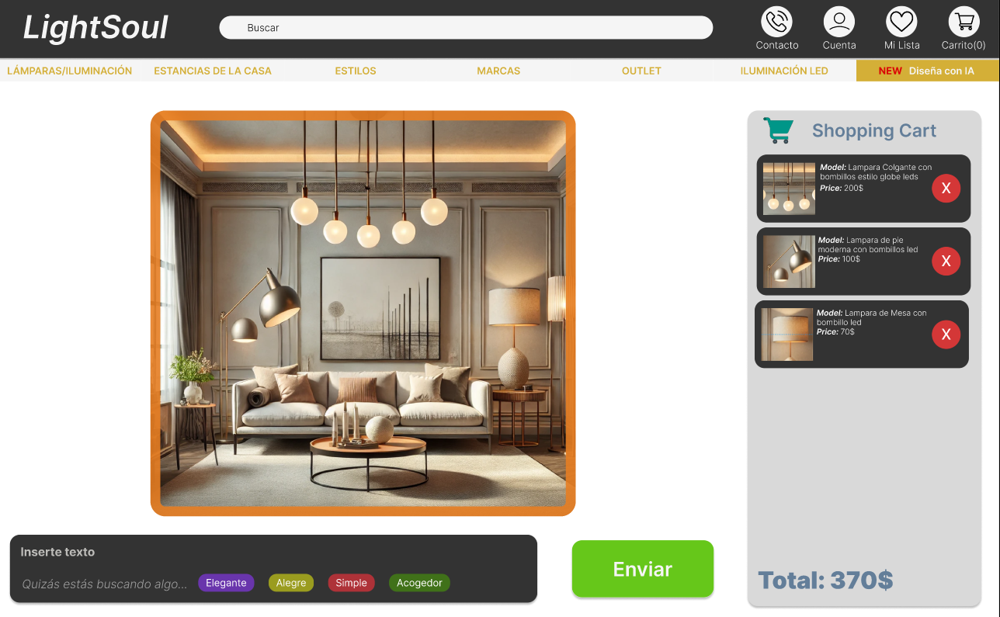
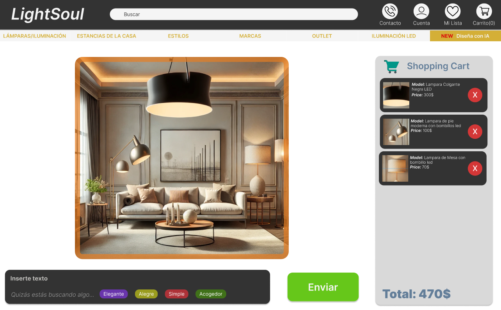
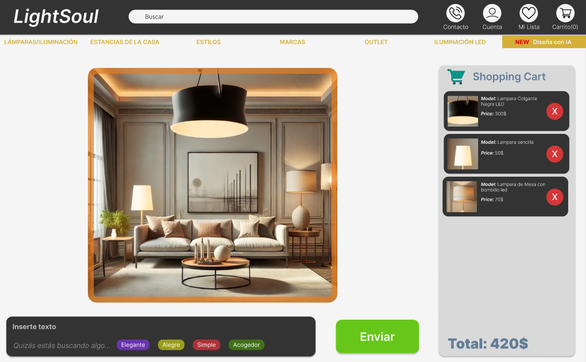
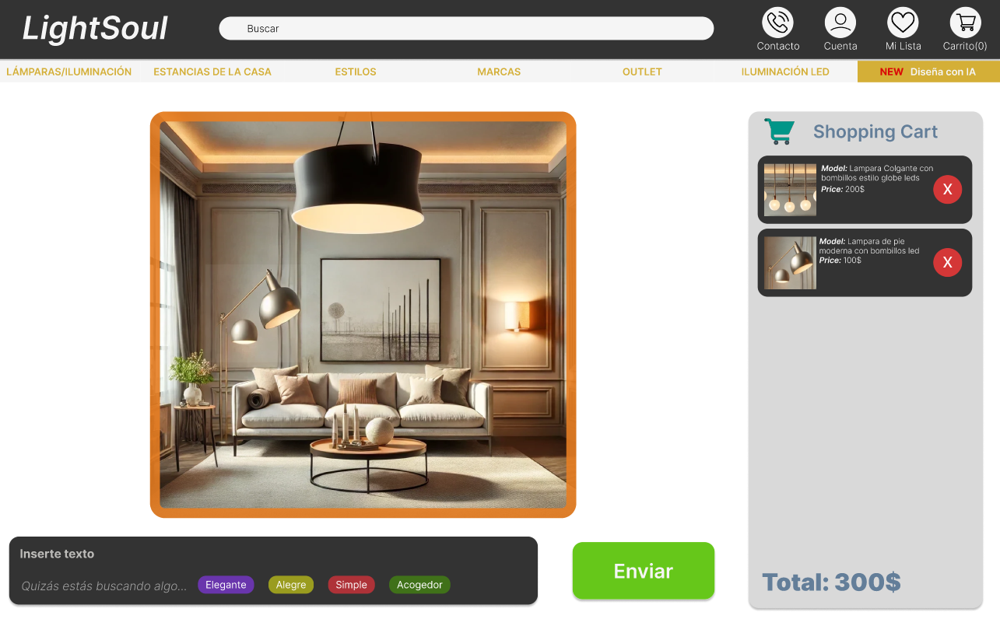
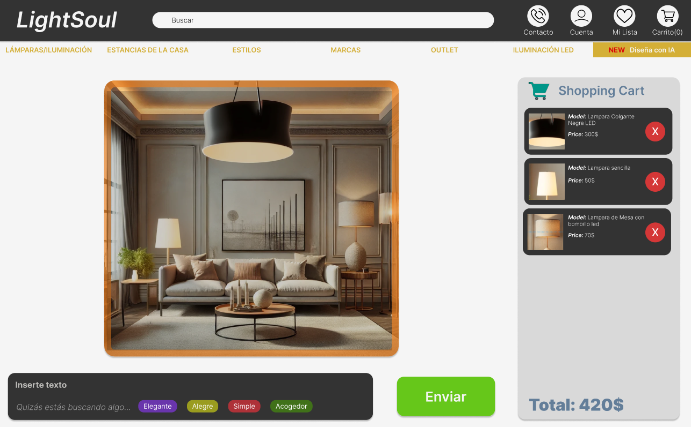

# Caso #2 - Diseño de Software 
## Light Soul

### Integrantes:
- Manuel Calero
- Eduardo Jimenez
- Pamela Morataya Sandoval
- Harlen Quirós
- Carlos Venegas

### Herramientas utilizadas
- Diseño: Figma
- Testing: Maze

## UI - Light Soul
### A continuación se presenta una serie de imágenes con el diseño de la interfaz y una breve explicación de la misma.

    
En esta pantalla se presenta la opción de carga de imágenes, donde podemos escoger una imagen desde nuestro dispositivo o traerla por medio de Drag&Drop

    

    
En esta pantalla nos redirigimos a escoger una imagen de nuestro dispositivo.

    

    
Seleccionamos la imagen de preferencia para crearle el diseño por medio de IA.

    

    
Ya en esta pantalla nos sale que tenemos nuestra imagen cargada en la página, ya solo queda que selecciones "Diseña con IA"

    

    
En esta pantalla, tenemos la opción de generar un texto con lo que buscamos o escoger que sea a elección de nuestra IA. En este caso la IA se va a encargar de colocar las lámparas que mejor se acoplen al lugar.

    

    
Ahora nos dirige a una pantalla en la cual nuestra IA colocó las lámparas que mejor quedaban en el lugar.

    

    
Podemos posicionarnos sobre lámpara de nuestra preferencia y agregarla al carrito de compras (en este caso escogimos las 3).

    

    
También tenemos la opción de cambiar una lámpara, en este caso cambiamos la del techo.

    

    
En este frame se puede apreciar cómo la lámpara izquierda cambió, eso puedes hacer las veces que necesites.

    

    
Si no te gusta una lámpara, puedes eliminarla. Eso hicimos con la que se encontraba a la derecha de nuestra sala.

    

    
Con nuestra IA tenemos la opción de observar nuestras lámparas apagadas y ver cómo se ve su lugar escogido.

    

    
Presionando en nuestras lámparas se pueden encender y así ver cuánta luminosidad ofrecen en su habitación.

    

## Proceso del test de usabilidad

Para lograr el test de usabilidad se utilizo la herramienta MAZE en donde se realizan distintas pruebas con el fin de testear el comportamiento de un usuario para así lograr una tarea específica en la página web, a continuación se adjunta el link al test https://t.maze.co/277309294.
Esta prueba consiste en varias tareas:
- Colocar la edad del participante.
Esta prueba se realiza para poder determinar el público y el rango de su edad, con el fin de ver si esto afecta.

- Cargar una imágen de entorno para probar distintas lámparas.
Esta prueba es importante ya que es necesario comprobar que el usuario pueda subir una imágen y así probar las lámparas en su ambiente deseado.

- Agregar al carrito las 3 lámparas de la imágen.
Esta prueba se realiza con el fin de probar que el usuario entiende la funcionalidad del carrito en la página web y así poder adquirir artículos.

- Responder a: ¿Sintió esta experiencia intuitiva?, sino, ¿qué se le dificultó?
Esta pregunta se realiza posterior a dos pruebas para así conocer la opinión del usuario posterior.

- Eliminar de la imágen alguna de las Lámparas
Esta prueba se realiza con el fin de que el usuario pueda probar distintas combinaciones de lámparas en la imágen.

- Testear la iluminación de las lámparas en la
Esta prueba se realiza con el fin de que el usuario logre probar la iluminación de las lámparas en la imágen.

- Responder a: ¿Qué le pareció esta experiencia?,¿Mejoraría algo?
Esta pregunta se realiza posterior a dos pruebas para así conocer la opinión del usuario con respecto a toda la prueba y que pueda dejar un comentario de retroalimentación.

Estas pruebas se realizan con el fin de obtener feedback y así poder mejorar el diseño de la página web.

## Sujetos de Prueba

Los sujetos de prueba que realizaron el test, fueron estudiantes del Tecnológico de Costa Rica, con una edad que ronda entre los 20 y los 22 años

    

## Resultados
En cuanto a los resultados que obtuvimos son los siguientes para cada tarea:

### Cargar una imagen de entorno para probar distintas lámparas

Tabla de respuestas de participantes en la interfaz, con detalles sobre la duración, el resultado y el camino seguido por cada participante.

    

Porcentaje de éxito en la prueba, porcentaje de mision sin finalizar, porcentaje de missclick que realizaron los usuarios y la duración promedio que les tomo a los usuarios completar la tarea.

    

Heatmaps de los wireframes de la tarea.

    
    

### Agregar al carrito las 3 lámparas de la imágen.
Tabla de respuestas de participantes en la interfaz, con detalles sobre la duración, el resultado y el camino seguido por cada participante.

    

Porcentaje de éxito en la prueba, porcentaje de mision sin finalizar, porcentaje de missclick que realizaron los usuarios y la duración promedio que les tomo a los usuarios completar la tarea.

    

Heatmaps de los wireframes de la tarea.

    
    
    

Como tal, tuvimos un 100% de ratio de acceso directo de parte de los usuarios a la hora de agregar un elemento al carrito, por otros detalles sin embargo, si hubo un porcentaje de alrededor del 14% en el que los usuarios no dieron click de forma correcta al objeto; finalmente, se considera que la duración promedio de cada usuario es de 21.3 segundos, lo cual no es mucho.

### Eliminar de la imágen alguna de las Lámparas
Tabla de respuestas de participantes en la interfaz, con detalles sobre la duración, el resultado y el camino seguido por cada participante.

    

Porcentaje de éxito en la prueba, porcentaje de mision sin finalizar, porcentaje de missclick que realizaron los usuarios y la duración promedio que les tomo a los usuarios completar la tarea.

    

Heatmaps de los wireframes de la tarea.

    
    

### Testear la iluminación de las lámparas en la imágen.
Tabla de respuestas de participantes en la interfaz, con detalles sobre la duración, el resultado y el camino seguido por cada participante.

    

Porcentaje de éxito en la prueba, porcentaje de mision sin finalizar, porcentaje de missclick que realizaron los usuarios y la duración promedio que les tomo a los usuarios completar la tarea.

    

Heatmaps de los wireframes de la tarea.

    
    

## Errores

### Error al eliminar las lámparas del carrito
A la hora que los usuarios van hacia la opción de eliminar imagen del carrito, muchos de ellos suelen darle click al botón X rojo al lado de la compra en el carrito, en el diseño como tal no fue aplicado.

De tal modo que se considera un error tanto visual como funcional, pues éste botón no cumple la función de eliminar del carrito y confunde al usuario.

    

A tomar en consideración para arreglar el error, tenemos 2 opciones, pero para facilitar al usuario, lo mejor sería permitir que el botón con forma de X si permita a los usuarios quitar el elemento de la lámpara, y quitar dicha opción del popup mejor.

### Error con las luces al apagarlas y encenderlas
A la hora que el usuario desee encender la luz como tal, o apagarla, la luz simplemente se enciende como tal o se mantiene apagada siempre; lo cual se puede considerar un posible error.

    

El punto más normal para solucionarlo sería tener en el sistema algo para que cuando esté encendido y el usuario le de click, se apague de forma correcta, y active el punto original, como un "flag".

### Error a la seleccionar la imagen
A la hora de seleccionar imagen para determinar la imagen para diseñar como tal, el usuario piensa que puede dar click a la imagen, pues le da click fuera del botón también... sin embargo, también pueden surgir problemas a la hora de seleccionar.

    

Para solucionar el posible error a la hora de buguear el sistema cuando se selecciona la imagen, es posible usar un "flag" como tal para determinar cuando la foto esté seleccionada.

## Tendencias

## Comportamientos

## Correcciones para mejorar el UI
Para mejorar el UI se tienen varias mejoras basadas en las pruebas:
- Agregar un set de instrucciones sobre cómo interactuar con las lámparas para así poder apagar y prender las distintas luces.
- Cuando el usuario quiera agregar una imagen se puede bloquear la pantalla para que el usuario no se pierda a la hora de realizar esta interacción.
- Habilitar el chat del IA con las recomendaciones hasta que el usuario entre en su etapa de diseño, ya que en las pruebas, el usuario clickeaba estos botones antes de estar funcionales.
- Aumentar el tamaño del cuadro de la imágen para que se pueda tener una mejor observación e interacción con los componentes.

