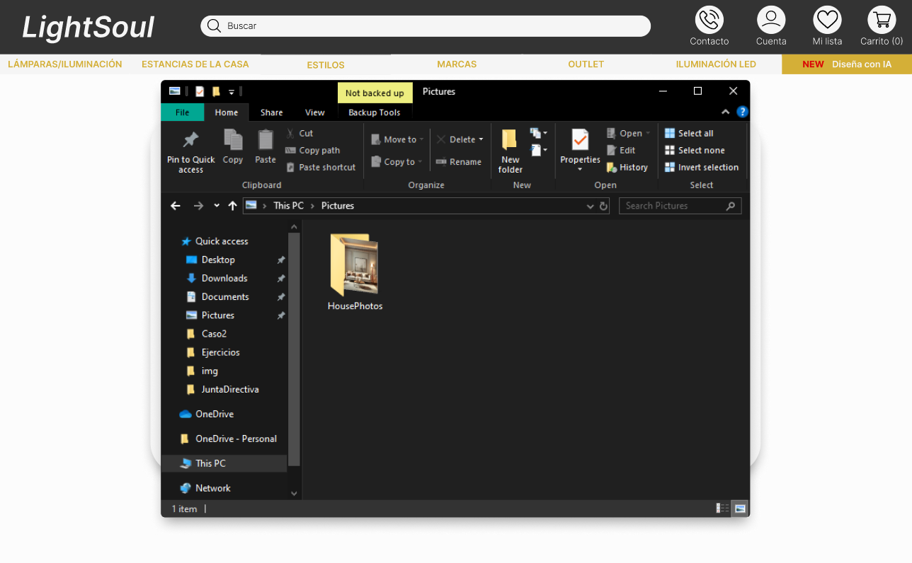

# Caso #2 - Diseño de Software 
## Light Soul

### Integrantes:
- Manuel Calero
- Eduardo Jimenez
- Pamela Morataya Sandoval
- Harlen Quirós
- Carlos Venegas

### Herramientas utilizadas
- Diseño: Figma
- Testing: Maze

## UI - Light Soul
### A continuación se presenta una serie de imágenes con el diseño de la interfaz y una breve explicación de la misma.

    
En esta pantalla se presenta la opción de carga de imágenes, donde podemos escoger una imagen desde nuestro dispositivo o traerla por medio de Drag&Drop

    

    
En esta pantalla nos redirigimos a escoger una imagen de nuestro dispositivo.

    

    
Seleccionamos la imagen de preferencia para crearle el diseño por medio de IA.

    

    
Ya en esta pantalla nos sale que tenemos nuestra imagen cargada en la página, ya solo queda que selecciones "Diseña con IA"

    

    
En esta pantalla, tenemos la opción de generar un texto con lo que buscamos o escoger que sea a elección de nuestra IA. En este caso la IA se va a encargar de colocar las lámparas que mejor se acoplen al lugar.

    

    
Ahora nos dirige a una pantalla en la cual nuestra IA colocó las lámparas que mejor quedaban en el lugar.

    

    
Podemos posicionarnos sobre lámpara de nuestra preferencia y agregarla al carrito de compras (en este caso escogimos las 3).

    

    
También tenemos la opción de cambiar una lámpara, en este caso cambiamos la del techo.

    

    
En este frame se puede apreciar cómo la lámpara izquierda cambió, eso puedes hacer las veces que necesites.

    

    
Si no te gusta una lámpara, puedes eliminarla. Eso hicimos con la que se encontraba a la derecha de nuestra sala.

    

    
Con nuestra IA tenemos la opción de observar nuestras lámparas apagadas y ver cómo se ve su lugar escogido.

    

    
Presionando en nuestras lámparas se pueden encender y así ver cuánta luminosidad ofrecen en su habitación.

    

